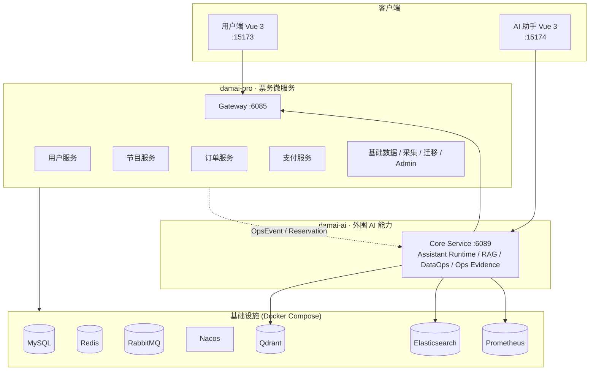

# damai — 票务系统全栈工程

基于 Spring Cloud Alibaba + Spring AI 的全栈票务系统，包含高并发微服务后端、AI 智能助手和多端前端。

> **Author**: Song <2212565023@qq.com> · [GitHub](https://github.com/LittleSongxx/damai)

---

## 架构总览



## 项目结构

```
damai/
├── damai-pro/          # 高并发票务微服务系统
│   ├── damai-server/   #   10 个可启动微服务
│   ├── damai-*-framework/  # 公共框架模块
│   ├── vue3/           #   用户端前端
│   └── docker-compose.yml
├── damai-ai/           # damai-pro 的外围 AI 能力
│   ├── damai-ai-domain/      # 领域模型与通用契约
│   ├── damai-ai-infra/       # 基础设施适配与网关
│   ├── damai-ai-runtime/     # Assistant Run / Skill SPI / 运行时边界
│   ├── damai-ai-business/    # 票务业务 AI 编排边界
│   ├── damai-ai-knowledge/   # 知识库 / RAG / 评测边界
│   ├── damai-ai-ops/         # Ops Evidence / DataOps / NL2SQL 边界
│   ├── damai-ai-customer/    # 客服工单与反馈闭环边界
│   ├── damai-ai-governance/  # Prompt / 质量门禁 / 治理边界
│   ├── damai-core-service/   # Spring Boot 启动与 Web/API 聚合
│   └── vue/                  # 客服、知识、问数、运维治理工作台
├── scripts/            # 工作区级启动脚本
└── pom.xml             # Maven 聚合
```

## 子项目

### [damai-pro](damai-pro/) — 高并发票务微服务

基于 Spring Cloud Alibaba 的微服务架构，覆盖：
- 9 个业务微服务（用户、节目、订单、支付、网关等）
- ShardingSphere 分库分表 + 基因法路由
- Redis 库存缓存 + Redisson 分布式锁
- RabbitMQ 异步订单 + Seata 分布式事务
- 多版本下单链路演进 + 中间件故障兜底

**技术栈**: Java 17 · Spring Boot 3.3 · Spring Cloud 2023 · Nacos · Sentinel · ShardingSphere · MyBatis Plus

### [damai-ai](damai-ai/) — 票务 AI 客服、问数与运维治理层

`damai-ai` 不替代 `damai-pro` 的核心交易系统，而是围绕售票平台提供外围 AI 能力：
- **客户侧智能客服** — FAQ/RAG 问答、票务处理、购票预览、人在环审批、转人工和反馈闭环
- **知识治理** — 版本化知识发布、证据引用、坏例沉淀、RAG 评测与质量门禁
- **运营问数 DataOps** — 基于 `damai-pro` 业务事件沉淀只读指标视图，NL2SQL 默认禁用并受语义目录与安全策略约束
- **智能运维 Ops Evidence** — 聚合日志、指标、Trace、告警、变更、拓扑、Runbook 和业务事件，缺证据时显式降级
- **平台治理** — Prompt、Skill、路由、质量评测、权限和审计统一收敛到 `/assistant/**`

**技术栈**: Java 17 · Spring Boot 3.5 · Spring AI 1.0 · Qdrant · Vue 3 · Naive UI

## 快速启动

### 一键启动

```bash
bash scripts/damai-stack.sh start
```

自动完成：Docker 基础设施 → 数据库初始化 → Maven 构建 → 后端服务启动 → 前端启动。

### 常用命令

```bash
bash scripts/damai-stack.sh status    # 查看状态
bash scripts/damai-stack.sh stop      # 停止全部
bash scripts/damai-stack.sh start --skip-build      # 跳过构建
bash scripts/damai-stack.sh start --skip-frontend   # 跳过前端
```

### 手动启动

参考各子项目文档：
- [damai-pro 本地开发](damai-pro/docs/local-dev.md)
- [damai-ai README](damai-ai/README.md)
- [联调指南](damai-pro/docs/damai-ai-integration.md)

## 服务地址一览

| 服务 | 地址 |
| --- | --- |
| damai-pro 用户端 | `http://127.0.0.1:15173` |
| damai-ai 前端 | `http://127.0.0.1:15174` |
| API 网关 | `http://127.0.0.1:6085` |
| AI 核心服务 | `http://127.0.0.1:6089` |
| Nacos | `http://127.0.0.1:18848/nacos` |
| Prometheus | `http://127.0.0.1:9090` |
| Elasticsearch | `http://127.0.0.1:19200` |
| Qdrant | `http://127.0.0.1:16333` |
| Spring Boot Admin | `http://127.0.0.1:10082` |

## 环境要求

- Docker（`docker compose` 可用）
- JDK 17+
- Maven 3.9+
- Node.js 24+ 与 npm

## 文档索引

| 文档 | 说明 |
| --- | --- |
| [damai-pro/README.md](damai-pro/README.md) | 票务微服务架构与模块说明 |
| [damai-ai/README.md](damai-ai/README.md) | AI 智能助手架构与能力说明 |
| [damai-pro/docs/local-dev.md](damai-pro/docs/local-dev.md) | 本地开发环境搭建 |
| [damai-pro/docs/damai-ai-integration.md](damai-pro/docs/damai-ai-integration.md) | AI + Pro 联调指南 |
| [damai-ai/RESUME.md](damai-ai/RESUME.md) | AI 项目技术亮点总结 |

## License

Apache License 2.0
