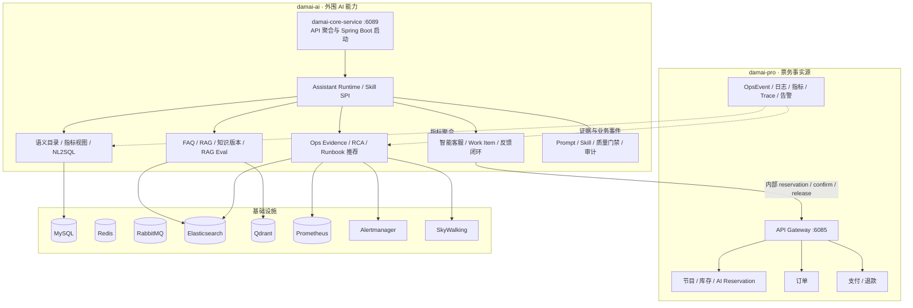

# damai-ai — 票务 AI 客服、问数与运维治理层

`damai-ai` 是 `damai-pro` 的外围 AI 能力，不替代核心票务交易系统。它负责自然语言交互、知识问答、购票审批编排、客服工单闭环、运营问数和运维证据分析；库存、座位、订单、支付、退款等业务事实仍由 `damai-pro` 负责。

> **Author**: Song &lt;2212565023@qq.com&gt; · [GitHub](https://github.com/LittleSongxx/damai)

---

## 系统定位



## 核心主线

| 主线 | 说明 |
| --- | --- |
| 客户侧智能客服 | 普通客户入口在 `damai-pro/vue3`，自动携带节目、订单和登录态上下文；支持 FAQ/RAG、票务咨询、购票预览审批、转人工和反馈 |
| 购票审批 | AI 只生成“不锁库存”的预览；用户审批后调用 `damai-pro` 内部 reservation → confirm → complete，失败、拒绝和过期走 release |
| 知识治理 | FAQ/RAG 必须返回证据、版本、范围和更新时间；负反馈、未解决工单和人工结论形成知识缺口，可转草稿和评测用例 |
| 客服工单 | 统一使用 Work Item 模型，支持技能组、SLA、接管、分配、处理、关闭、满意度和完整会话证据 |
| 运营问数 | `damai-pro` 发布 OpsEvent，`damai-ai` 落 raw event 并聚合为只读指标视图；NL2SQL 只面向管理员，默认禁用 |
| 智能运维 | RCA 只组装真实 provider 证据：日志、指标、Trace、告警、变更、拓扑、Runbook、业务事件；缺失 provider 时显式降级并要求人工复核 |
| 治理评测 | Prompt、Skill、路由、RAG、NL2SQL、质量门禁和审计统一收敛到 `/assistant/admin/**` |

## Maven 模块

`damai-ai` 使用直接 Maven 多模块来表达边界。当前可运行入口仍是 `damai-core-service`，它负责 Spring Boot 启动、Controller 与 API 聚合；边界模块用于沉淀领域契约、依赖方向和后续代码归位，不再把项目叙述成单一“大核心服务”。

```
damai-ai/
├── damai-ai-domain/       # 领域模型、DTO/VO、枚举、通用响应
├── damai-ai-infra/        # Mapper、缓存、MQ、外部网关、可观测适配
├── damai-ai-runtime/      # Assistant Run、Skill SPI、工具调用、Checkpoint 边界
├── damai-ai-business/     # 票务查询、预览、审批下单、风控边界
├── damai-ai-knowledge/    # FAQ、RAG、知识版本、知识质量边界
├── damai-ai-ops/          # DataOps、NL2SQL、Ops Evidence、RCA 边界
├── damai-ai-customer/     # Work Item、转人工、反馈、满意度边界
├── damai-ai-governance/   # Prompt、Skill、评测、质量门禁边界
├── damai-core-service/    # Spring Boot 启动与 Web/API 聚合模块
├── vue/                   # 客服/治理/问数/运维工作台
└── sql/                   # 全量基线 SQL 与 Flyway 迁移
```

## API 边界

- 客户侧统一入口：`/assistant/customer-service/**`
- 助手运行时入口：`/assistant/**`
- 管理端统一入口：`/assistant/admin/**`
- 数据问数管理：`/assistant/admin/dataops/**`
- 运维证据管理：`/assistant/admin/ops/**`

所有对外能力统一收敛到上述 `/assistant/**` 路径，不再维护分散的历史入口。

## 技术栈

| 分类 | 技术 |
| --- | --- |
| 后端基础 | Java 17 · Maven · Spring Boot 3.5 · MyBatis Plus · Flyway |
| AI 框架 | Spring AI 1.0 · ChatClient · Tool Calling · Structured Output |
| 模型接入 | 阿里百炼/Qwen · DeepSeek · Ollama 本地模型 |
| RAG | Qdrant · Elasticsearch BM25 · RRF 融合 · Rerank · 证据覆盖评估 |
| 问数 | OpsEvent raw 表 · 指标宽表 · 只读视图 · 语义目录 · NL2SQL 安全执行 |
| 运维证据 | Prometheus · Alertmanager · OpenTelemetry Collector · SkyWalking · ES 日志 |
| 数据与消息 | MySQL · Redis · RabbitMQ · Elasticsearch |
| 安全 | RBAC · 内部 Token · 工具沙箱 · NL2SQL 白名单/敏感字段/成本守卫 |
| 前端 | Vue 3 · Vite 6 · TypeScript · Naive UI · Pinia · Vitest |

## 环境变量

```bash
cp .env.example .env
```

| 变量 | 说明 |
| --- | --- |
| `DAMAI_AI_PORT` | 核心服务端口，默认 `6089` |
| `DAMAI_AI_MYSQL_URL` | `damai_ai` 数据库连接 |
| `DAMAI_REDIS_PASSWORD` | Redis 密码；本地 Docker Redis 默认留空 |
| `DAMAI_AI_ALIBABA_API_KEY` | 阿里百炼 API Key |
| `DAMAI_AI_DEEPSEEK_API_KEY` | DeepSeek API Key |
| `DAMAI_AI_OLLAMA_BASE_URL` | 本地 Ollama 地址 |
| `DAMAI_AI_QDRANT_URL` | Qdrant 向量库地址 |
| `DAMAI_INTERNAL_ACCESS_TOKEN` | 与 `damai-pro/.env` 相同的内部调用令牌 |
| `DAMAI_AI_FLYWAY_ENABLED` | 是否启用 Flyway 迁移 |
| `DAMAI_AI_NL2SQL_ENABLED` | NL2SQL 默认 `false`，启用前必须配置只读数据源 |
| `DAMAI_AI_NL2SQL_URL` | 只读指标库或只读视图数据源 |
| `DAMAI_AI_PROMETHEUS_URL` | Prometheus 地址 |
| `DAMAI_AI_ALERTMANAGER_URL` | Alertmanager 地址 |
| `DAMAI_AI_SKYWALKING_GRAPHQL_URL` | SkyWalking GraphQL 地址 |
| `VITE_DAMAI_AI_PROXY_TARGET` | 管理工作台代理目标 |

> API Key 和 `DAMAI_INTERNAL_ACCESS_TOKEN` 只写入本地 `.env` 或 IDE 运行配置，禁止硬编码或提交。

## 快速启动

### 一键启动

```bash
bash scripts/damai-stack.sh start
```

脚本会启动 Docker 依赖、初始化数据库、构建后端并启动两个前端。

### 手动启动

```bash
# 1. 启动 damai-pro 基础设施；需要运维证据组件时同时启用 ai-ops profile
cd ../damai-pro
docker compose --env-file .env --profile ai --profile ai-ops up -d

# 2. 启动 damai-ai 后端
cd ../damai-ai
mvn -pl damai-core-service spring-boot:run

# 3. 启动管理工作台
cd vue
npm install
npm run dev -- --host 127.0.0.1 --port 15174 --strictPort
```

## 服务端口

| 服务 | 地址 |
| --- | --- |
| damai-core-service | `http://127.0.0.1:6089` |
| damai-ai 管理工作台 | `http://127.0.0.1:15174` |
| damai-pro 网关 | `http://127.0.0.1:6085` |
| damai-pro 用户端 | `http://127.0.0.1:15173` |
| Prometheus | `http://127.0.0.1:9090` |
| Alertmanager | `http://127.0.0.1:9093` |
| SkyWalking UI | `http://127.0.0.1:18080` |
| Elasticsearch | `http://127.0.0.1:19200` |
| Qdrant | `http://127.0.0.1:16333` |

## 常见问题

| 问题 | 排查方向 |
| --- | --- |
| 模型鉴权失败 | 检查 `DAMAI_AI_ALIBABA_API_KEY` / `DAMAI_AI_DEEPSEEK_API_KEY` |
| RAG 返回为空 | 检查 Qdrant、ES、集合名、文档 scope/topic 权限过滤和向量维度 |
| AI 购票失败 | 确认 `damai-pro` 网关可达、内部 Token 一致、AI reservation 接口可用 |
| NL2SQL 不执行 | 这是默认安全策略；确认管理员权限、`DAMAI_AI_NL2SQL_ENABLED=true` 和只读数据源 |
| 运维证据缺失 | 检查 `ai-ops` profile 下 Prometheus、Alertmanager、OTel、SkyWalking 与 ES 是否有真实数据 |
| 工单/反馈无数据 | 检查登录态、Work Item 表、反馈事件和知识缺口生成流程 |

## 相关文档

- [`vue/README.md`](vue/README.md) — 管理工作台前端说明
- [`docs/assistant-mainline-architecture.md`](docs/assistant-mainline-architecture.md) — 售票平台 AI 客服与运营问数主线
- [`../damai-pro/docs/damai-ai-integration.md`](../damai-pro/docs/damai-ai-integration.md) — damai-ai + damai-pro 联调指南
- [`../README.md`](../README.md) — 工作区总览
