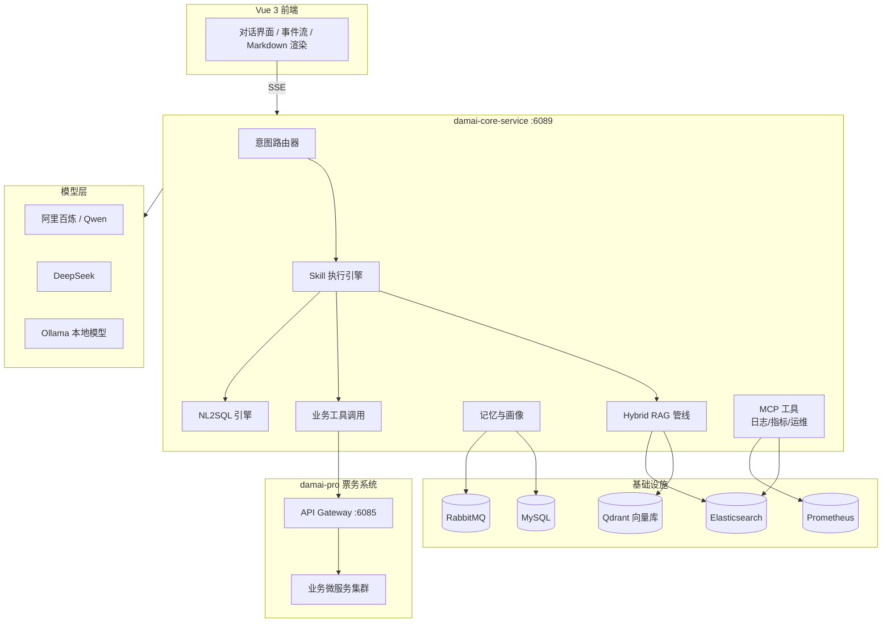
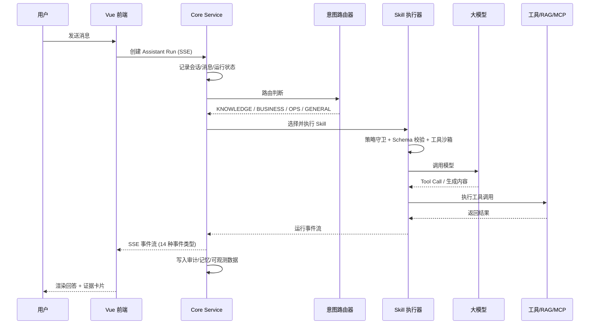
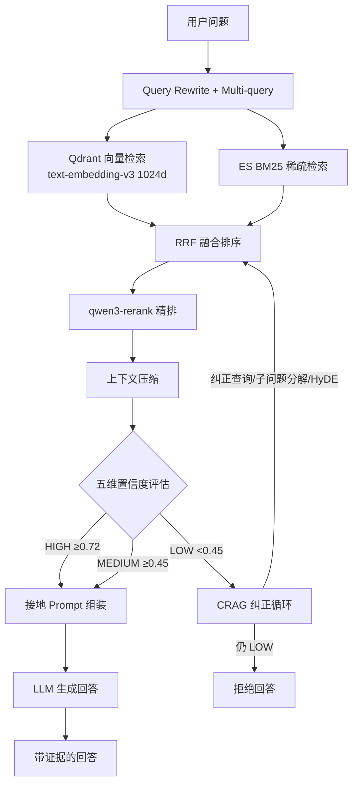
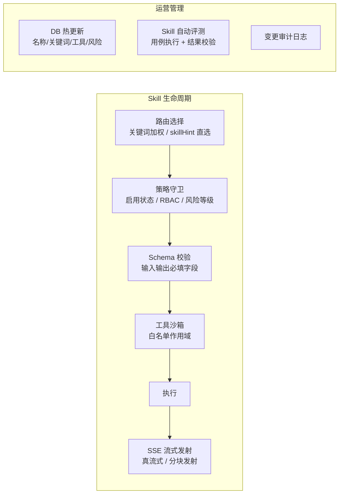

# damai-ai — 票务智能助手平台

面向票务领域的 AI 智能助手，围绕 **Assistant Run → Skill → Tool** 工作流，将大模型能力与传统票务系统深度整合。基于 Spring AI 构建，实现了 Hybrid RAG 知识问答、LLM Tool Calling 购票、联网搜索、NL2SQL 运维查询、内置 MCP 日志/指标/运维工具等核心能力。

> **Author**: Song &lt;2212565023@qq.com&gt; · [GitHub](https://github.com/LittleSongxx/damai)

---

## 系统架构总览



## 核心能力

| 能力模块 | 说明 |
| --- | --- |
| **Skill 执行引擎** | 统一 SkillExecutor 流水线：路由选择 → 策略守卫 → Schema 校验 → 工具沙箱 → 流式输出 → 14 种生命周期事件 |
| **Hybrid RAG (CRAG)** | Query Rewrite + Multi-query → 向量检索 + BM25 稀疏检索 → RRF 融合 → Rerank 精排 → 上下文压缩 → 五维置信度评估 → 纠正循环 → 接地回答 |
| **LLM Tool Calling** | 业务技能通过 Spring AI ChatClient 自主选择工具完成购票全链路，支持人在环审批 |
| **联网搜索** | 开放域问答时通过 Tavily/博查 获取联网证据，LLM 基于证据生成回答 |
| **NL2SQL 运维** | 自然语言 → SQL 生成 → AST 七层安全校验 → 执行 → 失败自动修复重试 |
| **MCP 运维工具** | 日志检索（7 工具）+ 指标诊断（8 工具）+ NL2SQL 查询，内置于核心服务，LLM 汇总证据输出诊断建议 |

## Assistant Run 执行流程



## 技术栈

| 分类 | 技术 |
| --- | --- |
| 后端基础 | Java 17 · Maven · Spring Boot 3.5 · MyBatis Plus |
| AI 框架 | Spring AI 1.0 · ChatClient · Advisor · Tool Calling · Structured Output |
| 模型接入 | 阿里百炼 (Qwen) · DeepSeek · Ollama 本地部署 |
| RAG | Qdrant (gRPC) · Elasticsearch BM25 · qwen3-rerank · 上下文压缩 |
| 记忆与画像 | JDBC Chat Memory · RabbitMQ 异步刷新 · 情景记忆 · 用户画像提取 |
| 工具调用 | Spring AI @Tool · 内置 MCP 工具治理 |
| 数据与消息 | MySQL · RabbitMQ · Elasticsearch · Easy-ES |
| 安全 | RBAC · 工具沙箱白名单 · NL2SQL AST 校验 · 风险等级守卫 |
| 可观测性 | Actuator · Prometheus · Token/耗时统计 · 全链路追溯 |
| 前端 | Vue 3 · Vite 6 · TypeScript · Naive UI · Pinia · marked + highlight.js |
| 测试 | JUnit 5 · Testcontainers · WireMock · Vitest (前端) |

## 模块结构

```
damai-ai/
├── damai-core-service/          # AI 核心服务
│   └── src/main/java/org/javaup/ai/
│       ├── assistant/           # Skill 引擎、路由、执行器、记忆、画像
│       │   └── mcp/tool/        # MCP 工具 (日志/指标/NL2SQL)
│       ├── rag/                 # RAG、多路检索、Rerank
│       ├── guardrails/          # 安全守卫与输入过滤
│       ├── security/            # 认证、权限、RBAC
│       ├── structured/          # 结构化输出
│       ├── resilience/          # 熔断与韧性
│       ├── metrics/             # 可观测指标
│       └── ...
├── vue/                         # AI 助手前端
└── sql/                         # 数据库初始化脚本
```

## 服务与端口

| 服务 | 端口 | 入口类 |
| --- | --- | --- |
| damai-core-service | `6089` | `org.javaup.ai.DaMaiAiCoreApplication` |
| AI 前端 (Vite) | `15174` | — |

## 环境变量

```bash
cp .env.example .env
```

| 变量 | 说明 |
| --- | --- |
| `DAMAI_AI_PORT` | 核心服务端口，默认 `6089` |
| `DAMAI_AI_MYSQL_URL` | `damai_ai` 数据库连接 |
| `DAMAI_REDIS_PASSWORD` | Redis 密码；本地 Docker Redis 默认留空 |
| `DAMAI_AI_ALIBABA_API_KEY` | 阿里百炼 API Key |
| `DAMAI_AI_DEEPSEEK_API_KEY` | DeepSeek API Key |
| `DAMAI_AI_OLLAMA_BASE_URL` | 本地 Ollama 地址 |
| `DAMAI_AI_QDRANT_URL` | Qdrant 向量库地址 |
| `DAMAI_AI_PROMETHEUS_URL` | Prometheus 指标地址，供内置运维工具读取 |
| `DAMAI_AI_NL2SQL_ENABLED` | NL2SQL 默认 `false`；启用前必须配置只读 `DAMAI_AI_NL2SQL_URL` |
| `DAMAI_AI_NL2SQL_URL` | 只读分析库或只暴露审批视图的 ShardingSphere 数据源 |
| `DAMAI_INTERNAL_ACCESS_TOKEN` | 与 `damai-pro/.env` 中相同的内部调用令牌 |
| `DAMAI_ALLOW_UNSAFE_NO_VERIFY_FALLBACK` | 是否允许退回旧 `no_verify` 鉴权，建议固定为 `false` |
| `DAMAI_AI_*_URL` | 指向 `damai-pro` 网关的业务接口 |
| `VITE_DAMAI_AI_PROXY_TARGET` | 前端代理目标 |

> **安全提示**: API Key 和 `DAMAI_INTERNAL_ACCESS_TOKEN` 仅写入本地 `.env` 或 IDE 运行配置，禁止硬编码或提交到仓库。

## 快速启动

### 一键启动（推荐）

```bash
bash scripts/damai-stack.sh start
```

脚本自动完成 Docker 依赖 → 数据库初始化 → Maven 构建 → 后端启动 → 前端启动。

用户侧 AI 主入口统一为 `/assistant`；历史对话入口不再维护。

### 手动启动

```bash
# 1. 确保 damai-pro Docker 依赖已启动
# 2. 启动后端
mvn -f damai-ai/pom.xml -pl damai-core-service spring-boot:run

# 3. 启动前端
cd damai-ai/vue && npm install && npm run dev -- --host 127.0.0.1 --port 15174 --strictPort
```

## Hybrid RAG 流程 (CRAG)



## Skill 治理体系



## 与 damai-pro 的关系

`damai-pro` 是**业务事实源**（库存、座位、订单、支付），`damai-ai` 是**智能交互层**。AI 帮助用户自然地完成查询和购票，但不绕过 `damai-pro` 的网关鉴权、库存扣减和支付约束。

联调前确认：
- `damai-gateway-service` → `http://127.0.0.1:6085`
- `damai-pro` 用户端 → `http://127.0.0.1:15173`
- `damai-ai` 前端 → `http://127.0.0.1:15174`
- `.env` 中业务接口地址指向 `damai-pro` 网关

## 常见问题

| 问题 | 排查方向 |
| --- | --- |
| 模型鉴权失败 | 检查 `DAMAI_AI_ALIBABA_API_KEY` / `DAMAI_AI_DEEPSEEK_API_KEY` |
| 本地模型不可用 | 确认 Ollama 已启动且模型名匹配 `DAMAI_AI_OLLAMA_CHAT_MODEL` |
| RAG 返回为空 | 检查 Qdrant 地址、集合名、文档加载路径和向量维度 |
| MCP 工具不可用 | 检查 ES/Prometheus 连接，以及 `damai-core-service` 内置 MCP 治理开关 |
| 无法调用业务接口 | 确认 `damai-pro` 网关可达、登录态有效 |
| 日志/指标为空 | 确认 ES 和 Prometheus 中有数据 |

## 相关文档

- [`vue/README.md`](vue/README.md) — AI 前端说明
- [`../damai-pro/docs/damai-ai-integration.md`](../damai-pro/docs/damai-ai-integration.md) — AI + Pro 联调指南
- [`../README.md`](../README.md) — 工作区总览
