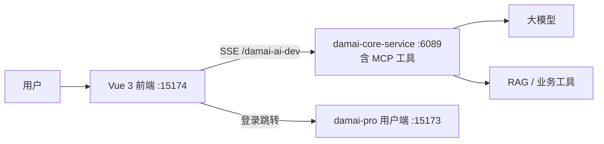

# damai-ai 前端

智能助手对话前端，提供会话管理、消息流渲染、运行事件展示、Markdown/代码高亮、业务助手交互和登录态跳转能力。



## 技术栈

| 分类 | 技术 |
| --- | --- |
| 框架 | Vue 3.4 · Vite 6 · TypeScript |
| UI | Naive UI · Heroicons |
| 状态与路由 | Pinia · Vue Router |
| Markdown | marked · highlight.js · DOMPurify |
| 测试 | Vitest · Vue Test Utils · jsdom |
| 运行时 | Node 24.x（见 `.nvmrc`） |

## 环境变量

```bash
cp .env.example .env
```

| 变量 | 说明 |
| --- | --- |
| `VITE_DAMAI_AI_BASE_URL` | AI 核心服务地址，默认 `http://127.0.0.1:6089` |
| `VITE_DAMAI_AI_PROXY_TARGET` | Vite 代理目标 |
| `VITE_DAMAI_PRO_LOGIN_URL` | 跳转 `damai-pro` 登录页 |

## 启动

```bash
npm install
npm run dev -- --host 127.0.0.1 --port 15174 --strictPort
```

通过工作区脚本启动时端口由 `DAMAI_AI_FRONTEND_PORT` 控制。

## 构建与测试

```bash
npm run type-check
npm run build
npm run test
npm run test:watch
```

## 开发代理

`vite.config.js` 将 `/damai-ai-dev` 前缀转发到 `VITE_DAMAI_AI_PROXY_TARGET`（默认 `damai-core-service:6089`）。

## 后端依赖

| 服务 | 用途 |
| --- | --- |
| `damai-core-service:6089` | 必须 — AI 核心服务 (含 MCP 运维工具) |
| `damai-pro` 网关 `:6085` | 业务助手所需 |
| Qdrant + Embedding 模型 | RAG 知识问答所需 |
| ES + Prometheus | MCP 运维工具数据源 |

## 常见问题

| 问题 | 排查 |
| --- | --- |
| Node 版本不一致 | 按 `.nvmrc` 切换到 Node 24 |
| AI 接口失败 | 检查代理目标和 `damai-core-service` 健康状态 |
| 登录跳转错误 | 检查 `VITE_DAMAI_PRO_LOGIN_URL` 端口 |
| Markdown 异常 | 检查 DOMPurify 过滤或高亮语言支持 |

## 相关文档

- [`../README.md`](../README.md) — damai-ai 后端架构
- [`../../damai-pro/docs/damai-ai-integration.md`](../../damai-pro/docs/damai-ai-integration.md) — 联调指南
