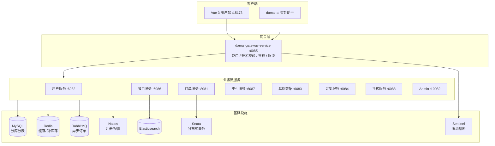
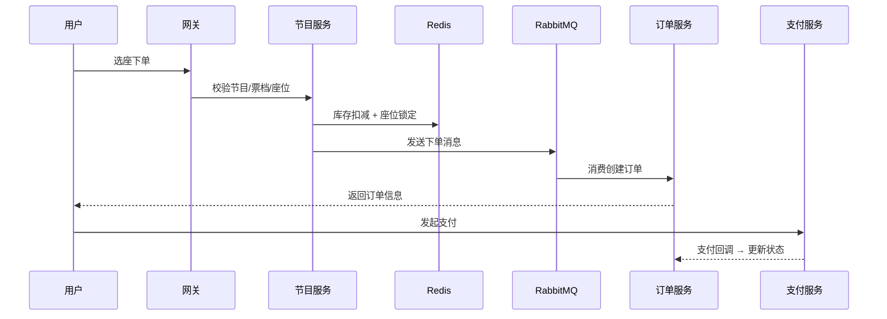

# damai-pro — 高并发票务微服务系统

基于 Spring Cloud Alibaba 的高并发票务微服务系统，覆盖演出浏览、选座锁座、库存扣减、异步下单、支付、分库分表、数据迁移与故障恢复全链路。

> **Author**: Song &lt;2212565023@qq.com&gt; · [GitHub](https://github.com/LittleSongxx/damai)

---

## 系统架构



## 核心设计

| 设计要点 | 实现方式 |
| --- | --- |
| **高并发下单** | 多版本下单链路 · 库存缓存 · 座位锁定 · 异步订单 · 限流与幂等 |
| **数据一致性** | Redis + MySQL + RabbitMQ + Seata + 补偿任务 + 后台核对 |
| **分库分表** | ShardingSphere · 基因法 · 虚拟分片 · 平滑扩容迁移 |
| **服务治理** | Nacos · Gateway · OpenFeign · Sentinel · Spring Boot Admin |
| **可观测性** | API 采集 · Elasticsearch · Prometheus · damai-ai 内置 MCP 诊断 |

## 下单链路



## 模块结构

```
damai-pro/
├── damai-common/                    # 公共模型、异常、响应结构、工具类
├── damai-redis-tool-framework/      # Redis 缓存、Lua 脚本、分布式缓存封装
├── damai-elasticsearch-framework/   # ES / Easy-ES 封装
├── damai-id-generator-framework/    # 分布式 ID 生成器 (Redis workId)
├── damai-spring-cloud-framework/    # Spring Cloud、OpenFeign、网关能力
├── damai-thread-pool-framework/     # 线程池与异步执行
├── damai-redisson-framework/        # 分布式锁、业务锁注解
├── damai-captcha-manage-framework/  # 验证码
├── damai-server-client/             # Feign Client 与 DTO
├── damai-server/                    # 可启动的业务微服务集合
│   ├── damai-gateway-service/
│   ├── damai-user-service/
│   ├── damai-program-service/
│   ├── damai-order-service/
│   ├── damai-pay-service/
│   ├── damai-base-data-service/
│   ├── damai-customize-service/
│   ├── damai-migrate-service/
│   ├── damai-mybatis-plus-service/
│   └── damai-admin-service/
├── vue3/                            # 用户端前端 (Vue 3 + Element Plus)
├── docker-compose.yml               # 本地基础设施编排
├── docs/                            # 开发文档
├── scripts/                         # 开发辅助脚本
└── sql/                             # 数据库初始化 SQL
```

## 微服务与端口

| 服务 | 端口 | 职责 |
| --- | --- | --- |
| damai-gateway-service | `6085` | 统一入口、路由、签名校验、鉴权过滤 |
| damai-user-service | `6082` | 用户、登录态、观演人 |
| damai-program-service | `6086` | 节目、场次、票档、座位、下单前置 |
| damai-order-service | `8081` | 订单创建/取消、MQ 消费、状态流转 |
| damai-pay-service | `6087` | 支付单、支付回调 |
| damai-base-data-service | `6083` | 渠道、地区、字典基础数据 |
| damai-customize-service | `6084` | API 采集、后台查询 |
| damai-migrate-service | `6088` | 分片迁移、扩容 |
| damai-mybatis-plus-service | `—` | MyBatis Plus 代码生成器 |
| damai-admin-service | `10082` | Spring Boot Admin |

## 基础设施 (Docker Compose)

| 组件 | 默认地址 |
| --- | --- |
| MySQL | `127.0.0.1:13306` |
| Redis | `127.0.0.1:16379` |
| Nacos | `127.0.0.1:18848/nacos` |
| RabbitMQ | AMQP `5672` · 管理端 `15672` |
| Elasticsearch | `127.0.0.1:19200` |
| Seata | `127.0.0.1:8091` |
| Sentinel | `127.0.0.1:8082` |
| Prometheus | `127.0.0.1:9090` |
| Qdrant | HTTP `127.0.0.1:16333` · gRPC `127.0.0.1:16334` |
| Ollama | `127.0.0.1:11434` |

端口冲突时修改 `.env` 后重新启动即可。

## 快速启动

### 一键启动（推荐）

```bash
docker compose --env-file .env --profile ai up -d
```

常用选项：

```bash
docker compose --env-file .env --profile ai ps
docker compose --env-file .env up -d rabbitmq
docker compose --env-file .env --profile ai up -d --remove-orphans
docker compose --env-file .env down
```

### 手动启动

```bash
# 1. Docker 基础设施
docker compose --env-file .env --profile ai up -d

# 2. 初始化数据库
# Linux: 见 sql/ 目录  |  Windows: scripts/init-databases.ps1

# 3. 按顺序启动服务
#    admin → base-data → customize → user → program → pay → order → migrate → gateway

# 4. 启动前端
cd vue3 && npm install && npm run dev -- --host 127.0.0.1 --port 15173 --strictPort
```

详细本地开发说明见 [`docs/local-dev.md`](docs/local-dev.md)。

## 技术栈

| 分类 | 技术 |
| --- | --- |
| 后端基础 | Java 17 · Maven · Spring Boot 3.3 |
| 微服务 | Spring Cloud 2023 · Spring Cloud Alibaba · Nacos · OpenFeign |
| 网关 | Spring Cloud Gateway · 签名校验 · SA-Token |
| 数据库 | MySQL · ShardingSphere 5.3 · MyBatis Plus |
| 缓存与锁 | Redis · Redisson · Lua 脚本 |
| 消息队列 | RabbitMQ · 异步订单创建 |
| 分布式事务 | Seata |
| 限流熔断 | Sentinel |
| 搜索 | Elasticsearch · Easy-ES |
| 监控 | Spring Boot Admin · Prometheus · Actuator |
| 前端 | Vue 3 · Vite · Element Plus · Pinia |

## 设计亮点

- **多版本下单演进** — 暴露多个创建订单版本，对比不同高并发策略效果
- **异步订单创建** — 节目服务前置校验+扣减，订单服务 MQ 消费创建，削峰填谷
- **分布式锁与防重** — Redisson 业务锁注解 + 重复执行限制
- **分库分表路由** — ShardingSphere + 基因法，按用户/订单维度定位分片
- **虚拟分片扩容** — 物理分片与业务之间增加虚拟映射，降低迁移风险
- **中间件故障兜底** — Redis/MQ/DB 不一致场景的恢复与核对机制
- **链路可观测** — API 采集 + ES + Prometheus，为 `damai-ai` 提供诊断数据

## 与 damai-ai 联动

`damai-ai` 通过网关接口调用节目检索、详情、票档、用户、观演人和下单能力。联调指南见 [`docs/damai-ai-integration.md`](docs/damai-ai-integration.md)。

## 常见问题

| 问题 | 排查方向 |
| --- | --- |
| Nacos 注册失败 | 检查 `DAMAI_NACOS_ADDR`、账号密码、容器状态 |
| 数据库连接失败 | 检查 `DAMAI_MYSQL_HOST`/`PORT`、分片 YAML |
| 前端接口 404 | Vite 代理前缀、网关路由、`/damai/**` 路径 |
| 网关裸请求失败 | 网关有签名过滤器，通过前端或验证脚本发请求 |
| 订单未创建 | 检查 RabbitMQ 队列、消费者、座位锁 |
| AI 无法下单 | 确认用户端已登录、AI 环境变量指向网关、`DAMAI_INTERNAL_ACCESS_TOKEN` 在 `damai-pro/.env` 与 `damai-ai/.env` 中一致 |

## 相关文档

- [`docs/local-dev.md`](docs/local-dev.md) — 本地开发、IDEA 配置、数据库初始化
- [`docs/damai-ai-integration.md`](docs/damai-ai-integration.md) — AI 联调指南
- [`vue3/README.md`](vue3/README.md) — 用户端前端说明
- [`damai-id-generator-framework/README.md`](damai-id-generator-framework/README.md) — 分布式 ID 生成器
