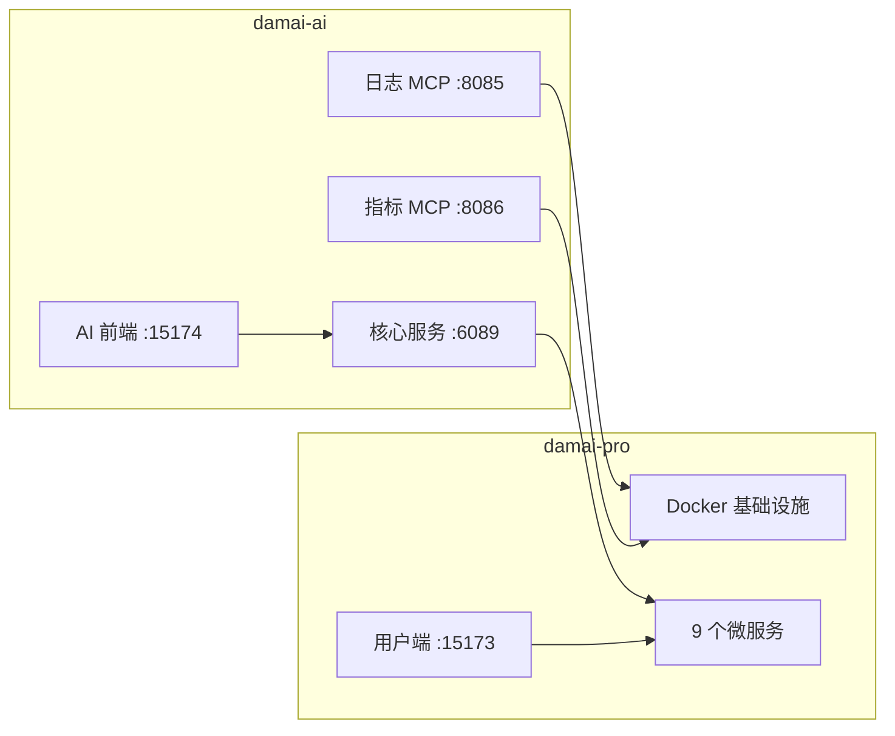

# damai-ai + damai-pro 联调指南

两个子项目联合部署的完整流程。



## 1) 准备环境变量

```bash
# damai-pro
cp .env.example .env

# damai-ai
cp ../damai-ai/.env.example ../damai-ai/.env
cp ../damai-ai/vue/.env.example ../damai-ai/vue/.env
```

编辑 `damai-ai/.env`，至少填写：
- `DAMAI_AI_ALIBABA_API_KEY`
- `DAMAI_AI_DEEPSEEK_API_KEY`

> 仅用 Ollama 时可留空上述 Key，确保 `DAMAI_AI_OLLAMA_BASE_URL` 可访问即可。

## 2) 启动 Docker 依赖

```bash
docker compose --env-file .env --profile ai up -d
```

启动内容：MySQL · Redis · Nacos · RabbitMQ · ES · Seata · Sentinel · Prometheus · Qdrant · Ollama。

## 3) 初始化数据库

```bash
# 包含 damai-ai 表结构:
.\scripts\init-databases.ps1

# 仅 damai-pro:
.\scripts\init-databases.ps1 -SkipDamaiAiSql
```

Linux 环境可直接使用 `sql/` 目录下的 SQL 文件手动导入。

## 4) 启动应用

1. **damai-pro 后端**：按 [`local-dev.md`](local-dev.md) 顺序启动 9 个微服务。
2. **damai-ai 后端**：

```bash
# 加载环境变量后启动
mvn -f damai-ai/pom.xml -pl damai-core-service spring-boot:run
mvn -f damai-ai/pom.xml -pl damai-mcp-server/damai-mcp-log-service spring-boot:run
mvn -f damai-ai/pom.xml -pl damai-mcp-server/damai-mcp-metrics-service spring-boot:run
```

3. **前端**：

```bash
# damai-pro 用户端
cd damai-pro/vue3 && npm install && npm run dev -- --port 15173 --strictPort

# damai-ai 前端
cd damai-ai/vue && npm install && npm run dev -- --port 15174 --strictPort
```

或使用一键脚本：`bash scripts/damai-stack.sh start`

## 5) 关键地址

| 服务 | 地址 |
| --- | --- |
| damai-pro 网关 | `http://127.0.0.1:6085` |
| damai-pro 用户端 | `http://127.0.0.1:15173` |
| damai-ai 核心服务 | `http://127.0.0.1:6089` |
| damai-ai 前端 | `http://127.0.0.1:15174` |
| MCP 日志 SSE | `http://127.0.0.1:8085/sse` |
| MCP 指标 SSE | `http://127.0.0.1:8086/sse` |
| Prometheus | `http://127.0.0.1:9090` |

## 6) 常见问题

| 问题 | 排查 |
| --- | --- |
| 401 / 鉴权失败 | `DAMAI_AI_*_API_KEY` 是否填写正确、无多余空格 |
| AI 无法下单 | `DAMAI_AI_*_URL` 是否指向 `damai-pro` 网关 |
| 指标查询为空 | `docker compose --profile ai ps` 中 prometheus 状态 |
| ES 查询失败 | `DAMAI_ES_ADDR` / 账号密码与 `damai-pro/.env` 一致性 |
| MCP 连接超时 | 8085/8086 服务是否启动、SSE 地址配置 |

