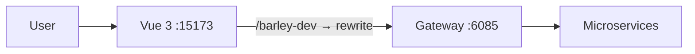

# damai-pro User Frontend

Customer-facing ticket purchasing frontend covering program browsing, search, details, seat selection, login, orders, and payment.



## Tech Stack

| Category | Technology |
| --- | --- |
| Framework | Vue 3.2 · Vite 3 |
| UI | Element Plus · @element-plus/icons-vue |
| State & Routing | Pinia · Vue Router |
| Request & Security | Axios · CryptoJS · JSEncrypt · jsrsasign |
| Charts & Editor | ECharts · Vue Quill |

## Development

```bash
npm install
npm run dev -- --host 127.0.0.1 --port 15173 --strictPort
```

## Build

```bash
npm run build
npm run preview
```

## Proxy Settings

| Variable | Description |
| --- | --- |
| `VITE_APP_BASE_API` | Proxy prefix `/barley-dev` |
| `VITE_APP_URL` | Gateway target `http://127.0.0.1:6085` |
| `VITE_SIGN_FLAG` | Signature switch |
| `VITE_CODE` | Channel code `0001` |
| `VITE_CREATE_ORDER_VERSION` | Order version `4` (async) |

## Backend Dependencies

| Service | Port |
| --- | --- |
| damai-gateway-service | `6085` |
| damai-user-service | `6082` |
| damai-program-service | `6086` |
| damai-order-service | `8081` |
| damai-pay-service | `6087` |

## Troubleshooting

| Issue | Fix |
| --- | --- |
| 404 from APIs | Check proxy prefix, gateway routes, `/damai/**` paths |
| Order fails | Check order version, program service, RabbitMQ |
| Auth fails | Login state, signature switch, channel code |
| Port conflict | `--strictPort` or update `DAMAI_PRO_FRONTEND_PORT` |

## Related Docs

- [`../README.md`](../README.md) — damai-pro backend overview
- [`../docs/local-dev.md`](../docs/local-dev.md) — Local development guide

